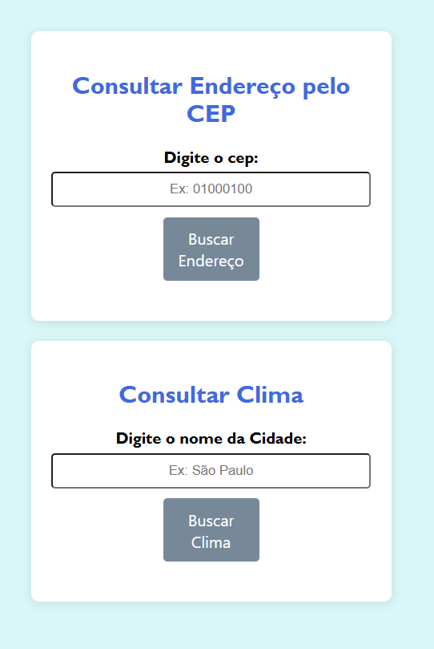

---

# 🌦️ Consulta de CEP e Clima com JavaScript

Este projeto simples utiliza **JavaScript** e **AJAX** para fazer consultas de CEP e buscar o clima de uma cidade usando APIs públicas. A interface permite que o usuário insira um CEP e receba o endereço correspondente, ou insira o nome de uma cidade e veja as condições climáticas atuais.

## 🚀 Funcionalidades

- **Busca de Endereço pelo CEP**: Insira um CEP válido de 8 dígitos para obter o endereço completo, incluindo logradouro, bairro, cidade e estado.
- **Consulta do Clima**: Informe o nome de uma cidade para visualizar as informações do clima, como temperatura, condição atual, umidade e velocidade do vento.

## 🛠️ Tecnologias Utilizadas

- **HTML**: Estrutura básica da página.
- **CSS**: Estilos simples (opcional, não incluído no exemplo).
- **JavaScript**: Lógica para capturar o CEP e cidade, fazer requisições às APIs e exibir os resultados.
- **AJAX**: Usado para fazer chamadas assíncronas às APIs.
- **APIs**:
  - [ViaCEP](https://viacep.com.br/) para consulta de CEP.
  - [OpenWeatherMap](https://openweathermap.org/) para consulta do clima.

## 🎨 Interface

A interface consiste em dois campos de entrada e botões de busca:

- **Consulta de CEP**: 
  - Campo para inserir o CEP.
  - Botão para buscar o endereço correspondente.

- **Consulta de Clima**: 
  - Campo para inserir o nome da cidade.
  - Botão para buscar as informações climáticas.

## 📜 Código

### JavaScript

Aqui está o código principal usado no projeto:

```javascript
document.addEventListener('DOMContentLoaded', function() {

    // Busca CEP
    var botaoCep = document.getElementById('buscarCep');
    var enderecoDiv = document.getElementById('endereco');

    botaoCep.addEventListener('click', function() {
        var cep = document.getElementById('cep').value;

        if (cep.length !== 8 || isNaN(cep)) {
            enderecoDiv.innerHTML = 'Por favor, insira um CEP válido com 8 dígitos.';
            return;
        }

        var meuAjaxCep = new XMLHttpRequest();
        meuAjaxCep.open('GET', `https://viacep.com.br/ws/${cep}/json/`, true);

        meuAjaxCep.onload = function() {
            if (meuAjaxCep.status === 200) {
                var dados = JSON.parse(meuAjaxCep.responseText);
                if (dados.erro) {
                    enderecoDiv.innerHTML = 'CEP não encontrado. Verifique e tente novamente';
                } else {
                    enderecoDiv.innerHTML = `
                        <p><strong>Logradouro:</strong> ${dados.logradouro}</p>
                        <p><strong>Bairro:</strong> ${dados.bairro}</p>
                        <p><strong>Cidade:</strong> ${dados.localidade}</p>
                        <p><strong>Estado:</strong> ${dados.uf}</p>
                    `;
                }
            } else {
                enderecoDiv.innerHTML = 'Erro ao buscar o CEP. Tente novamente mais tarde.';
            }
        };

        meuAjaxCep.send();
    });

    // Buscar Clima
    var botaoClima = document.getElementById('buscarClima');
    var climaDiv = document.getElementById('clima');
    var apikey = 'SUA_API_KEY_AQUI';

    botaoClima.addEventListener('click', function() {
        var cidade = document.getElementById('cidade').value;

        if (cidade === '') {
            climaDiv.innerHTML = 'Por favor, insira o nome de uma cidade.';
            return;
        }

        var meuAjaxClima = new XMLHttpRequest();
        meuAjaxClima.open('GET', `https://api.openweathermap.org/data/2.5/weather?q=${cidade}&appid=${apikey}&lang=pt_br&units=metric`, true);

        meuAjaxClima.onload = function() {
            if (meuAjaxClima.status === 200) {
                var dadosClima = JSON.parse(meuAjaxClima.responseText);
                climaDiv.innerHTML = `
                    <p><strong>Clima em ${dadosClima.name}:</strong></p>
                    <p>Temperatura: ${dadosClima.main.temp}°C</p>
                    <p>Condição: ${dadosClima.weather[0].description}</p>
                    <p>Umidade: ${dadosClima.main.humidity}%</p>
                    <p>Vento: ${dadosClima.wind.speed} m/s</p>
                `;
            } else {
                climaDiv.innerHTML = 'Cidade não encontrada. Tente novamente.';
            }
        };

        meuAjaxClima.send();
    });

});
```

## 📷 Prints


## 📝 Como usar

1. Clone o repositório para sua máquina local:
   ```bash
   git clone https://github.com/seuusuario/seurepositorio.git
   ```

2. Abra o arquivo `index.html` no seu navegador.

3. Insira um CEP e/ou o nome de uma cidade para testar as funcionalidades.

## 🌐 Contribuição

Sinta-se à vontade para abrir issues ou enviar pull requests se tiver sugestões de melhorias ou encontrar bugs.

## ⚠️ Licença

Este projeto está sob a licença MIT. Consulte o arquivo LICENSE para obter mais informações.

---